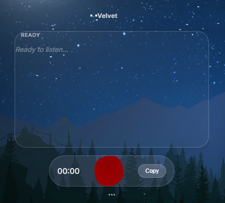
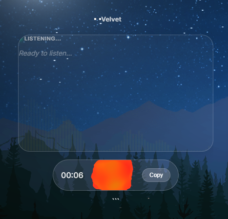
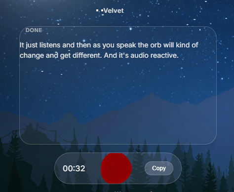

# Velvet

Local speech-to-text that runs entirely on your machine. No API keys, no cloud, no subscriptions. Click the orb, speak, get text.

<p align="center">
  
  
  
</p>

## What It Does

1. Click the orb to start recording
2. Speak — the orb reacts to your voice in real-time (WebGL shader + FFT audio analysis)
3. Click again to stop — transcription happens locally via [faster-whisper](https://github.com/SYSTRAN/faster-whisper)
4. Text auto-copies to your clipboard

The window is transparent and always-on-top — it floats over your desktop like a glass HUD.

## Stack

| Layer | Tech |
|-------|------|
| Window | Electron (frameless, transparent, always-on-top) |
| UI | HTML/CSS glass panels + Three.js WebGL orb with custom GLSL shaders |
| Audio | Web Audio API (FFT visualization) + Python sounddevice (capture) |
| Transcription | [faster-whisper](https://github.com/SYSTRAN/faster-whisper) medium model (~1.5 GB) |
| Backend | Python Flask server on localhost |
| GPU | CUDA float16 (auto-falls back to CPU int8) |

## Setup

**Prerequisites:** Python 3.10+, Node.js 18+, a microphone

```bash
# Clone
git clone https://github.com/desertcache/velvet.git
cd velvet

# Python dependencies
pip install -r requirements.txt

# Electron
npm install

# Launch
start.bat          # Windows
npx electron .     # Any platform
```

Electron automatically starts the Python backend — no need to run it separately.

> **First run:** The whisper model (~1.5 GB) downloads automatically. This takes a few minutes depending on your connection. The status will show "Loading model..." until it's ready.

### CUDA (optional)

CUDA is used automatically if available — transcription is significantly faster on GPU. If you don't have a CUDA GPU, it falls back to CPU (int8) with no extra configuration.

For CUDA support, you need the [NVIDIA cuDNN](https://developer.nvidia.com/cudnn) and [cuBLAS](https://developer.nvidia.com/cublas) libraries installed. See the [faster-whisper docs](https://github.com/SYSTRAN/faster-whisper#requirements) for details.

### Platform notes

- **Windows:** Transparent window with acrylic blur works out of the box
- **macOS/Linux:** Electron transparency works but the acrylic blur effect may vary by compositor

## How It Works

The UI has three layers:

- **Glass panels** — CSS `backdrop-filter: blur(8px)` with near-zero opacity backgrounds over a transparent Electron window
- **Soul Orb** — A Three.js sphere with custom vertex/fragment shaders. Simplex noise deforms the mesh, fresnel shading creates edge glow, and voice amplitude drives real-time shape morphing
- **Waveform visualizer** — Canvas-drawn frequency bars from Web Audio API FFT data, masked with a gradient fade

The orb has four visual states (IDLE / LISTENING / PROCESSING / SPEAKING), each defining colors, noise parameters, scale, and shape. All transitions are lerped frame-by-frame for smooth organic motion.

## Files

```
velvet/
├── main.js           # Electron main process (window config + spawns Flask)
├── preload.js        # IPC bridge (minimize/close)
├── index.html        # UI — glass panels, controls, waveform canvas
├── orb.js            # Three.js SoulOrb — WebGL shaders, state machine, audio reactivity
├── server.py         # Flask backend — mic capture, whisper transcription
├── start.bat         # Windows launcher
├── requirements.txt  # Python deps
└── package.json      # Electron dep
```

## API

The Flask backend runs on `localhost:5111`:

| Endpoint | Method | Description |
|----------|--------|-------------|
| `/status` | GET | Model load state + device (CUDA/CPU) |
| `/record` | POST | Start mic capture |
| `/stop` | POST | Stop capture |
| `/transcribe` | POST | Run whisper on captured audio, return text |

## License

MIT
