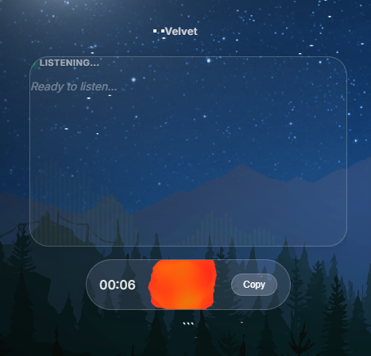

# Velvet

**A local-first, push-to-talk speech-to-text desktop app with an audio-reactive 3D orb. No cloud, no API keys.**

Velvet is an Electron desktop app that transcribes your voice entirely on-device using Whisper (`large-v3` via faster-whisper). It runs as a frameless, translucent always-on-top window with a Three.js/GLSL orb that morphs and changes color in response to your live microphone input. All audio capture and inference happen on your own machine; nothing leaves localhost.

## What's hard about this

The interesting engineering is in stitching three runtimes (a Chromium renderer, an Electron main process, and a Python inference process) into something that feels like one fluid app.

- **On-device Whisper as a managed sidecar.** Electron's main process spawns a Python Flask server (`server.py`, port 5111) as a child process at launch and pipes its stdout/stderr back. The renderer never touches the model directly: it drives recording over a small localhost HTTP API (`/record`, `/stop`, `/partial`, `/transcribe`, `/status`). The model loads on a background thread so the Flask event loop stays responsive while `large-v3` warms up, and the renderer polls `/status` (90s timeout) before enabling the record button.

- **CUDA-with-CPU-fallback that actually verifies the GPU.** Loading the model on `device="cuda"` succeeds even when cuDNN is missing, then explodes at first inference. So `load_model()` runs a throwaway transcription on a buffer of zeros immediately after the CUDA load; only if that round-trips does it commit to GPU. Any exception falls back to a CPU `int8` model. The GPU path uses `int8_float16` (int8 weights, fp16 activations) specifically to fit `large-v3` in 8GB VRAM. cuDNN/cuBLAS DLLs from the pip-installed `nvidia-*` packages are injected into the DLL search path at import time via `os.add_dll_directory`, which is the usual reason a Windows faster-whisper GPU build silently won't load.

- **Two-tier transcription: live partials + a high-quality final pass.** While recording, a daemon thread re-transcribes the full accumulated audio every ~2s with `beam_size=1` for cheap, fast partials that stream to the UI. On stop, a final pass runs with `beam_size=5`, VAD filtering, and a domain `initial_prompt` (seeded with terms like "Claude Code", "MCP", "faster-whisper", "CUDA") to bias decoding toward dev/technical vocabulary. Audio is captured at 16 kHz mono float32 via `sounddevice` callbacks into a chunk list and concatenated on demand.

- **Frameless, transparent, always-on-top window.** The `BrowserWindow` is `frame: false`, `transparent: true`, `alwaysOnTop: true` with acrylic background material, so the whole UI is a single CSS "glass" surface (backdrop blur, SVG fractal-noise overlay, prismatic edge layers). Window dragging is handled with `-webkit-app-region: drag` on the header, and the close/minimize "traffic lights" route through IPC since there's no OS chrome.

- **Secure IPC boundary.** `contextIsolation: true` / `nodeIntegration: false` means the renderer has no Node access. A `preload.js` `contextBridge` exposes a minimal `electronAPI` surface (`minimize`, `close`, `pythonStatus`, `onPythonDied`). When the Python sidecar dies, main forwards the captured stderr to the renderer over IPC so the failure shows up as a readable status message instead of a hung "loading" state.

- **GLSL orb driven by a live FFT.** The renderer runs its own Web Audio `AnalyserNode` (`fftSize: 512`) on the mic stream, averages the frequency bins into a single volume scalar (with a noise gate), and pushes it into a Three.js `ShaderMaterial` as `uAmplitude`. The vertex shader displaces a 128x128 sphere using layered 3D simplex noise and blends between a "blob" and a "liquid silk" mode (`uShapeMorph`); a Fresnel term in the fragment shader drives the emissive rim glow. The app crossfades between IDLE / LISTENING / SPEAKING / PROCESSING states by lerping every uniform (colors, noise frequency, scale, morph) per frame, so transitions are smooth rather than snapping. Note the FFT for the visualizer is computed in-browser and is independent of the audio the Python side captures for transcription.

## Stack

- **Electron 40** — desktop shell, main/renderer/preload split, frameless transparent window.
- **Three.js 0.160 + custom GLSL** — audio-reactive orb (vertex/fragment shaders, simplex noise, Fresnel).
- **Web Audio API** — `getUserMedia` + `AnalyserNode` FFT for the live visualizer.
- **Python + Flask + flask-cors** — local inference sidecar exposing an HTTP API on `127.0.0.1:5111`.
- **faster-whisper (`large-v3`)** — on-device Whisper inference; CUDA `int8_float16` with CPU `int8` fallback.
- **sounddevice + NumPy** — 16 kHz mono audio capture and buffering.

## Run it

Velvet needs **Node.js** (for Electron) and **Python 3.11** (for the inference server) on the same machine. GPU is optional; it falls back to CPU automatically.

```bash
# 1. Install Node deps (Electron)
npm install

# 2. Install Python deps (use the 3.11 interpreter the app launches)
py -3.11 -m pip install -r requirements.txt

# 3. Launch — this starts the Python server AND the Electron window
npx electron .
# or just run start.bat on Windows
```

On first launch faster-whisper downloads the `large-v3` weights, so the initial "Loading model..." can take a while; the orb stays in a loading state until `/status` reports ready. Click the orb to start/stop recording; transcripts stream live and finalize with a higher-quality pass on stop. Use the **Copy** button to grab the text.

> **Platform note:** the launcher hardcodes the Windows Python launcher (`py -3.11`) in `main.js` and ships Windows helpers (`start.bat`, `launch.vbs`), so it's wired for Windows out of the box. On macOS/Linux you would swap the `spawn('py', ['-3.11', ...])` call in `main.js` for your local Python 3.11 binary.
